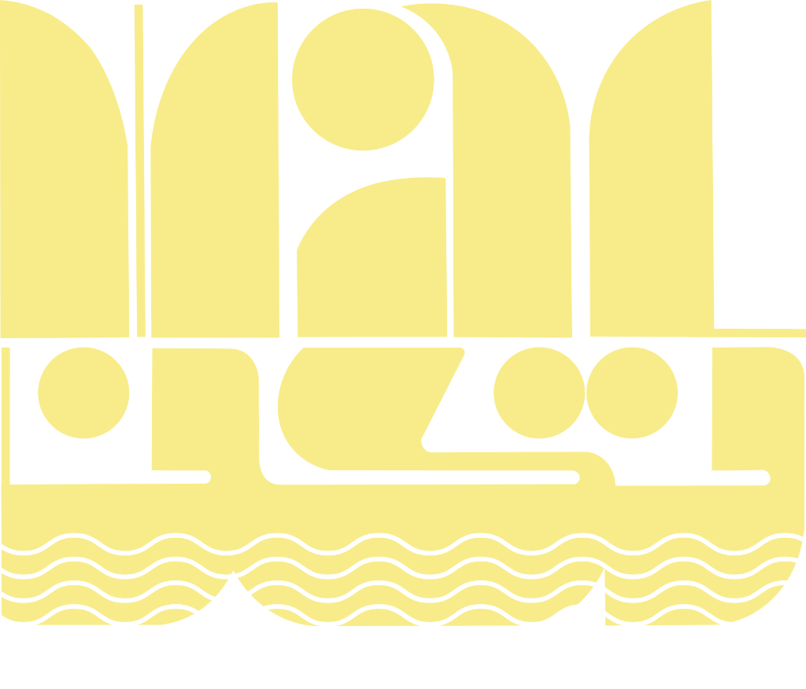

# 🌟 WALTAKUN 2026 — Arts Fest & Student Portal Launch Portal
### *'ഫന്നിന്റെ കൗന്'* — Official Grand Unveiling Web Application



---

## ✨ Features & Architecture

1. **Official Poster Design & Assets**:
   - High-resolution transparent typography logo (`assets/logo-transparent.png`).
   - Official poster textured velvet crimson background (`assets/poster-wide.jpg`).
   - Ornate concentric circles divider motif (`assets/pattern-circles.png`).
   - Official Malayalam motto callout: **'ഫന്നിന്റെ കൗന്'** (Fanninte Kaun).
2. **Dual Website Launch Console**:
   - **Arts Fest Website**: Official fest stage schedules, galleries, cultural competitions.
   - **Student Portal**: Registrations, live points table, scoreboards, and participant login.
   - **Dual Launch Mode**: Unveil both platforms simultaneously.
3. **Pure Text Capsule Action Button (No Emojis)**:
   - Big horizontal pill-shaped capsule launch button.
   - Pure typography, glowing champagne gold borders, and subtle pulse aura.
   - No emojis anywhere on the interface.
4. **Cinematic Sound Engine**:
   - **Classical Metronome & Orchestral Tension Ticks**: Acoustic wooden knocking and harmonic bell tension climbing from 5 down to 1.
   - **Heavy Sub-Bass Drop**: Deep cinematic room-shaking bass drop (140Hz down to 28Hz) upon ignition.
   - **Classical Brass Fanfare**: Majestic chord celebration upon unveiling.
   - 100% native Web Audio API — **no external MP3 files needed**.
5. **Dedicated Settings Panel**:
   - Capsule `SETTINGS` button in the top navigation bar.
   - Configure both target URLs, festival title, motto, countdown duration, sound toggle, and stage fullscreen mode.
   - Zero Instagram clutter.

---

## ⚙️ How to Configure Target URLs

### Option 1: On-Screen Settings
1. Open `index.html` in your browser.
2. Click **Settings** in the top navigation bar.
3. Enter the URLs for:
   - **Arts Fest Website** (e.g. `https://waltakun2026.com`)
   - **Student Portal** (e.g. `https://portal.waltakun2026.com`)
4. Click **Save & Apply**.

### Option 2: In Code
Open [`js/config.js`](./js/config.js):
```javascript
artsFestUrl: "https://your-artsfest-website.com",
studentPortalUrl: "https://your-student-portal.com",
```

---

## 🚀 How to Run Locally

Double-click [`index.html`](./index.html) to open in your browser, or run a local static server:
```bash
npx serve .
```

---

© 2026 **WALTAKUN 2026** • 'ഫന്നിന്റെ കൗന്' • Walthakun Darul Uloom Artfest.
